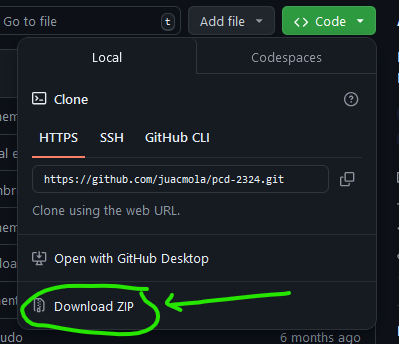

# Exercises of Concurrent and Distributed Programming 
---
##### Disclaimer
The project is intended for educational purpose only.

---
## Contents
- [Introduction](#introduction)
- [How to Use the Project](#how-to-use-the-project)
- [Exercise 1 - (Ejercicio 1)](#exercise-1---ejercicio-1)
- [Exercise 2 - (Ejercicio 2)](#exercise-2---ejercicio-2)
- [Exercise 3 - (Ejercicio 3)](#exercise-3---ejercicio-3)
- [Exercise 4 - (Ejercicio 4)](#exercise-4---ejercicio-4)
- [Credits](#credits)
- [License](#license)

---
## Introduction
This repository contains the exercises of the course of Concurrent and Distributed Programming. The course is part of the Degree of Computer Science of the University of Murcia (Universidad de Murcia). This course is being taught in the second semester of the second year of the degree. In this case, our participation in the course was in the academic year 2023/2024. The course was taught by the professor Sergio López Bernal.

The project is divided into four exercises. We attached both the code and the report of each exercise. As you can see, we have used the Java programming language to solve the exercises.

The reports and the code comments are written in Spanish. If you have any questions, please do not hesitate to contact us.

[Back to contents](#contents)

---
## How to Use the Project
In this case, we have used Eclipse IDE to develop the exercises, but you can use another IDE. We have implemented Java 8 in the exercises. 
To run the exercises, you can follow the following steps:
1. Download the repository. Click the 'Code' button and download the ZIP file.

2. Import the project into Eclipse. Go to File -> Import -> General -> Existing Projects into Workspace.
3. Each folder represents all the classes used in each exercise. You can run the main class of each exercise to see the results. We will especifie the main class in the section of each exercise.

[Back to contents](#contents)

---
## Exercise 1 - (Ejercicio 1)
>We have 10 consumer processes, a process that generates numbers and operations (product, sum and remainder) and an sum process.
The generator process alternately introduces a number and an operation, in blocks of 6 numbers and 5 operations, in an array of 110 elements in size.
Each consumer process has to read 11 consecutive positions of the array and calculate the final result of performing the indicated operations. For example, if in the first 5 positions a process finds the following sequence '3*5+2' the result would be '17'. Once the result of processing the 11 positions has been calculated, it will dump it into another matrix and print its ID and the result it has calculated on the screen. Once all the processes have calculated their part and dumped it into the results vector, the adder process must calculate the sum of all the results and display it on the screen. You must use ReentrantLock.

You can find the solution in the foulder [`ejercicio1`](./Boletin/src/ejercicio1) . We have implemented the following classes:
- [`HiloGenerador.java`](./Boletin/src/ejercicio1/HiloGenerador.java) (This class generates the numbers and operations)
- [`HiloConsumidor.java`](./Boletin/src/ejercicio1/HiloConsumidor.java) (This class consumes the numbers and operations)
- [`HiloSumador.java`](./Boletin/src/ejercicio1/HiloSumador.java) (This class sums the results)
- [`Ejercicio1.java`](./Boletin/src/ejercicio1/Ejercicio1.java) (Main class)

To try the exercise, you have to run the `Ejercicio1.java` class.

[Back to contents](#contents)

---
## Exercise 2 - (Ejercicio 2)
>Imagine an intersection with traffic lights for pedestrians and vehicles. The intersection has two traffic lights for vehicles (North-South and East-West) and one pedestrian light.
At any given time, only one of the three traffic lights can be green, with the turn of traffic rotating sequentially every 5 seconds.
A vehicle takes half a second to cross the intersection, while a pedestrian takes 3 seconds. The roadway can accommodate 4 vehicles simultaneously in each direction, while the pedestrian crossing can accommodate 10 pedestrians. In addition, each vehicle that crosses the intersection in one direction, 7 seconds later tries to cross it in the other direction. Each pedestrian tries to cross it again every 8 seconds. To avoid accidents, only elements of the intersection can be crossing (pedestrians, vehicles in a North-South direction or vehicles in an East-West direction), so the intersection must be empty before crossing begins in a new turn (despite being green).
Implement a program using traffic lights to coordinate the continuous passage of 50 vehicles and 100 pedestrians at the intersection in a synchronized manner. All vehicles start in a North-South direction (and will continually alternate their direction as the turns pass). Print on the screen the traffic light that is green (turn) and the tracking of who is crossing.

You can find the solution in the foulder [`ejercicio2`](./Boletin/src/ejercicio2). We have implemented the following classes:
- [`CruceP.java`](./Boletin/src/ejercicio2/CruceP.java) (This class represents the pedestrians crossing)
- [`CruceV.java`](./Boletin/src/ejercicio2/CruceV.java) (This class represents the vehicles crossing)
- [`HiloCruce.java`](./Boletin/src/ejercicio2/HiloCruce.java) (This class represents the crossing thread)
- [`Main.java`](./Boletin/src/ejercicio2/Main.java) (Main class)
  
To try the exercise, you have to run the `Main.java` class.

[Back to contents](#contents)

---
## Exercise 3 - (Ejercicio 3)
>In this exercise, we are going to represent, using a concurrent program, the activity in a bank where customers go to be served to carry out transactions. To be served, the bank has 4 desks to serve people simultaneously. Let's suppose that a customer enters the bank, has to go to a machine and choose the service they need (this action takes X milliseconds to complete). The bank has a total of 3 machines, the customer will have to sit at the first one that is free, once they select the service they need, they go to the queue with the shortest waiting time. When a customer is being served, it takes Y milliseconds at the table. Using monitors for synchronization, we will do a simulation where there will be 50 client threads with their X, Y values ​​initialized randomly.

You can find the solution in the foulder [`ejercicio3`](./Boletin/src/ejercicio3). We have implemented the following classes:
- [`HiloCliente.java`](./Boletin/src/ejercicio3/HiloCliente.java) (This class represents the client thread)
- [`MonitorMesa.java`](./Boletin/src/ejercicio3/MonitorMesa.java) (This class represents the table monitor)
- [`MonitorMaquina.java`](./Boletin/src/ejercicio3/MonitorMaquina.java) (This class represents the machine monitor)
- [`Main.java`](./Boletin/src/ejercicio3/Main.java) (Main class)

To try the exercise, you have to run the `Main.java` class.

[Back to contents](#contents)

---
## Exercise 4 - (Ejercicio 4)
>Let's consider a set of 30 people who buy and have to pay for their purchases. To pay there are two checkouts, checkout A and B, with checkout A being faster than checkout B. Each person has to use a checkout to pay for an estimated time (random value between 1 and 10) by the checkout controller. The checkout controller, when a new person arrives to pay, estimates the payment time and those people whose estimated time is greater than or equal to 5 will be assigned to A. The other people will be assigned checkout B. Each person will buy and pay 5 times, i.e. the thread repeats the following sequence of actions 5 times: 1) Makes the purchase (represented with a Thread.sleep(randomTime) call), 2) requests to be placed at a checkout, 3) Makes the payment at the checkout, 4) releases the checkout and 5) prints to the screen.

You can find the solution in the foulder [`ejercicio4`](./Boletin/src/ejercicio4). We have implemented the following classes:
- [`HiloComprador.java`](./Boletin/src/ejercicio4/HiloComprador.java) (This class represents the buyer thread)
- [`HiloControlador.java`](./Boletin/src/ejercicio4/HiloControlador.java) (This class represents the controller thread)
- [`Main.java`](./Boletin/src/ejercicio4/Main.java) (Main class)

To try the exercise, you have to run the `Main.java` class.

[Back to contents](#contents)

---
## Credits
The project was developed by the following people:

- [juacmola](https://github.com/juacmola)
- [Effect3](https://github.com/Effect3)

We counted with the supervision of our professor Sergio López Bernal ([LinkedIn](https://www.linkedin.com/in/slopezbernal/?originalSubdomain=es)) ([Investigation Web](https://portalinvestigacion.um.es/investigadores/815441/detalle)).

Lastly, this is part of one of the courses of the Degree of Computer Science of the [Universidad de Murcia](https://www.um.es/web/estudios/grados/informatica) - (Universidad de Murcia).

[Back to contents](#contents)

---
## License
This project has the default copyright license. That means that no one may reproduce, distribute, or create derivative works from our work.

[Back to contents](#contents)

---
###### README.md created with ❤️ by [juacmola](https://github.com/juacmola)
